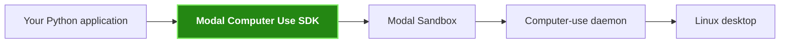

Modal Computer Use provides a typed Python SDK and an in-Sandbox daemon. You can control the mouse, keyboard, browser, files, screenshots, and recordings.

This is an independent project that uses Modal.

## Run the quickstart

You need Python 3.12 or later. You also need a Modal account with local credentials.

Install the package with the Modal extra:

```bash
uv add "modal-computer-use[modal]"
```

Save this file as `quickstart.py`:

```python
from modal_computer_use import (
    BrowserConfig,
    ComputerConfig,
    ComputerSandbox,
    ResourceConfig,
)

config = ComputerConfig(
    resources=ResourceConfig(profile="browser"),
    browser=BrowserConfig(kind="chromium"),
)

with ComputerSandbox.create(config=config) as computer:
    computer.browser.open_url("https://example.com")
    computer.mouse.move(320, 240)
    screenshot = computer.screenshots.full()
    screenshot.save("screenshot.png")
    print(screenshot.width, screenshot.height, screenshot.sha256)
```

Run the file:

```bash
uv run python quickstart.py
```

The SDK terminates the Sandbox when the `with` block ends. It also closes the daemon connection.

<CardGroup cols={2}>
  <Card title="Install" href="/start/installation">
    Install the package and set up Modal credentials.
  </Card>
  <Card title="Choose an example" href="/start/examples">
    Find a maintained pattern for your use case and lifecycle.
  </Card>
  <Card title="Create or attach" href="/build/create-and-attach">
    Choose the lifecycle that matches your application.
  </Card>
  <Card title="Automate a browser" href="/build/browser-automation">
    Configure Chromium or Firefox and open a page.
  </Card>
  <Card title="Run action batches" href="/build/action-batches">
    Send ordered desktop actions in one request.
  </Card>
  <Card title="Capture output" href="/build/screenshots-recordings">
    Save screenshots and record the desktop.
  </Card>
  <Card title="Persist artifacts" href="/build/artifacts-storage">
    Store files in a Sandbox or a Modal Volume.
  </Card>
</CardGroup>

## How the parts connect



Your application owns the task and any model loop. The SDK owns Modal orchestration. The daemon executes desktop primitives inside the Sandbox.

## Choose an API surface

| Need | API |
| --- | --- |
| Create a desktop from synchronous Python | `ComputerSandbox.create()` |
| Create a desktop from async Python | `AsyncComputerSandbox.create()` |
| Attach to an existing Modal Sandbox | `ComputerSandbox.attach()` |
| Connect to an existing daemon | `DaemonClient` or `AsyncDaemonClient` |
| Borrow a desktop in a deployed Modal Function | `ComputerSessionHandle.borrow_async()` |

Use the [Python API guide](https://github.com/ashtonchew/modal-computer-use/blob/main/docs/api.md) for the complete contract. Use the [OpenAPI schema](https://github.com/ashtonchew/modal-computer-use/blob/main/docs/openapi.json) for HTTP request and response models.
